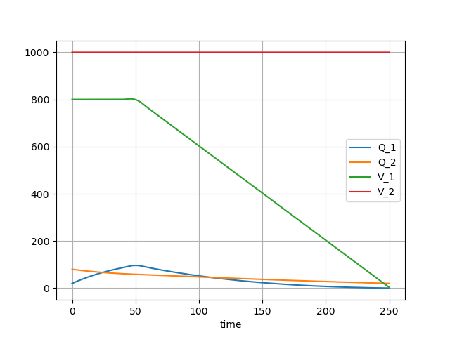

# Multiple tanks mixing problem

??? info "Raw code"

    The raw code for this example without explanations can be found [here](https://github.com/casasglobal-org/psymple/blob/main/examples/mixing_problems/2-multiple_tanks.py).

The previous example modelled a mixing problem with a single tank, which had an external flow in and an external flow out. This example considers a mixing problem consisting of two or more tanks, each of which can have external flows in and out, and which furthermore can have flows to and from other tanks in the system.

## System data

It will help to first specify the system data. The following data specifies a system of $2$ tanks which are fully interconnected, and each have external flows both in and out. This data can be freely altered to reflect different configurations and all the code in this example will automatically run.

```py title="system data"
# Number of tanks
n = 2

# List of tanks created
tanks_id = [i for i in range(1, n + 1)]

# List of pipes between tanks eg. (1,2) is a pipe from tank 1 to tank 2
link_pipes_id = [
    (i, j) 
    for i in tanks_id 
    for j in tanks_id 
    if j != i
]

# List of tanks with an external pipe in
pipes_in_id = [1, 2]

# List of tanks with an external pipe out
pipes_out_id = [1, 2]
```

## Defining the flow components

As for the [single tank example](single_tank.md#modelling-flows-in-psymple), a tank is defined as the aggregation of multiple variables representing inflows and outflows. The following lists of pipes in and out are created in exactly the same way for the single tank example, with pipes in for every tank in `pipes_in_id` and pipes out for every tank in `pipes_out_id`.

```py title="external pipes"
from psymple.build import VariablePortedObject

pipes_in = [
    VariablePortedObject(
        name=f"in_{i}",
        assignments=[
            ("Q_in", "rate * conc"),
            ("V_in", "rate"),
        ],
    )
    for i in pipes_in_id
]

pipes_out = [
    VariablePortedObject(
        name=f"out_{i}",
        assignments=[
            ("Q_out", "-rate * Q_out / V_out"), 
            ("V_out", "-rate")
        ],
    )
    for i in pipes_out_id
]
```

To connect two tanks, a connector pipe is required. These have four variables:

- `Q_in`, the amount of salt entering the pipe from a tank,
- `Q_out`, the amount of salt flowing into the next tank. Note that this has the same concentration
    as for `Q_in`,
- `V_in`, the volume of water entering the pipe from the tank,
- `V_out`, the volume of water exiting the pipe into the next tank.

A connector pipe is defined for every pair in `link_pipes_id`.

```py title="connector pipes"
connectors = [
    VariablePortedObject(
        name=f"pipe_{i}_{j}",
        assignments=[
            ("Q_in", "- rate * Q_in / V_in"),
            ("Q_out", "rate * Q_in / V_in"),
            ("V_in", "-rate"),
            ("V_out", "rate"),
        ],
    )
    for i, j in link_pipes_id
]
```

## Defining the system

The system is defined by variables `Q_1`,...,`Q_n` and `V_1`,...,`V_n` representing the mass and volume in each of the $n$ tanks. This is done in an analogous way to the single tank example, where the only thing which becomes more complicated is the aggregation of the variables. Each tank `i`, and therefore each variable `Q_i` (and `V_i`), can have:

- External in-flows if `i in pipes_in_id`,
- External out-flows if `i in pipes_out_id`,
- A flow to tank `j` for every `j` such that `(i,j) in link_pipes_id`,
- A flow from tank `j` for every `j` such that `(j,i) in link_pipes_id`.

The variable_wires data simply aggregates all these variables to `Q_i` (and `V_i`).

```py title="tanks model"
from psymple.build import CompositePortedObject

tanks = CompositePortedObject(
    name="tanks",
    children=pipes_in + pipes_out + connectors,
    variable_ports=[f"Q_{i}" for i in tanks_id]
    + [f"V_{i}" for i in tanks_id],
    input_ports=[f"rate_{i}_{j}" for i, j in link_pipes_id]
    + [f"conc_in_{i}" for i in pipes_in_id]
    + [f"rate_in_{i}" for i in pipes_in_id]
    + [f"rate_out_{i}" for i in pipes_out_id],
    directed_wires=[
        (f"rate_{i}_{j}", f"pipe_{i}_{j}.rate")
        for i, j in link_pipes_id
    ]
    + [(f"conc_in_{i}", f"in_{i}.conc") for i in pipes_in_id]
    + [(f"rate_out_{i}", f"out_{i}.rate") for i in pipes_out_id]
    + [(f"rate_in_{i}", f"in_{i}.rate") for i in pipes_in_id],
    variable_wires=[
        (
            ([f"in_{i}.Q_in"] if i in pipes_in_id else [])
            + ([f"out_{i}.Q_out"] if i in pipes_out_id else [])            
            + [f"pipe_{j}_{i}.Q_out" for j in tanks_id if j != i]
            + [f"pipe_{i}_{j}.Q_in" for j in tanks_id if j != i],
            f"Q_{i}",
        )
        for i in tanks_id
    ]
    + [
        (
            ([f"in_{i}.V_in"] if i in pipes_in_id else [])
            + ([f"out_{i}.V_out"] if i in pipes_out_id else [])
            + [f"pipe_{j}_{i}.V_out" for j in tanks_id if j != i]
            + [f"pipe_{i}_{j}.V_in" for j in tanks_id if j != i],
            f"V_{i}",
        )
        for i in tanks_id
    ],
)
```

And that's it!

## Simulating the system

The following code sets up a simulation in which for $t<50$>, there are flows of $10\text{l/s}$ (from tank 2) and $4 \text{l/s}$ (external) into tank 1 and flows of $3\text{l/s}$ (to tank 2) and $11\text{l/s}$ (external) out. Similarly, tank 2 has flows in of $3\text{l/s}$ (from tank 1) and $7\text{l/s}$ (external) and flows out of $10\text{l/s}$ (to tank 1).

The external concentration of the fluid entering tank 1 is $0.5\text{g/l}$ and for tank 2 only pure water is added. 

The total amount of solution in each tank will remain constant for $t<50$. At $t=50$ the external supply to tank 1 is turned off so that the volume of tank 1 will start to drain.

```py
S = System(tanks)
S.compile()

S.set_parameters(
    {
        "rate_1_2": 3,
        "rate_2_1": 10,
        "rate_in_1": "Piecewise((4, T<50), (0, True))",
        "rate_in_2": 7,
        "conc_in_1": 0.5,
        "conc_in_2": 0,
        "rate_out_1": 11,
        "rate_out_2": 0,
    }
)

print(S)

sym = S.create_simulation(
    initial_values={"Q_1": 20, "Q_2": 80, "V_1": 800, "V_2": 1000}
)

sym.simulate(t_end=250)

sym.plot_solution()
```

The following plot shows the result of the simulation until tank 1 is empty after $250\text{s}$. 



The figure shows that the concentrations in the two tanks decreasing after $t=50$ since only fresh water is added to the system after this point.