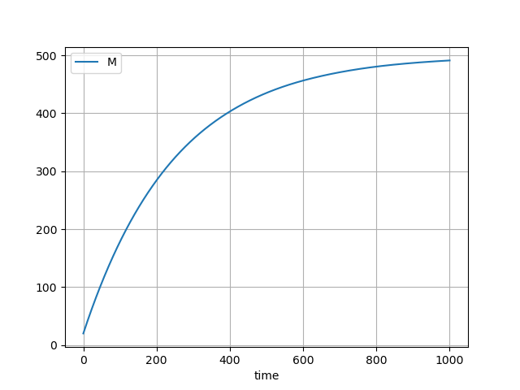
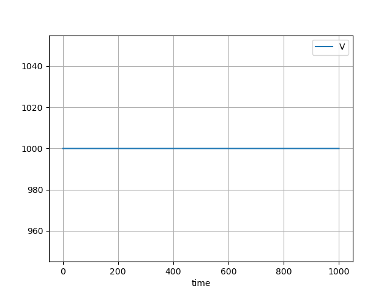

# Single tank mixing problem

??? info "Raw code"

    The raw code for this example without explanations can be found [here](https://github.com/casasglobal-org/psymple/blob/main/examples/mixing_problems/1-single_tank.py).

Consider a single tank with an initial volume of water $V_0\,\mathrm{l}$ and an initial amount of $M_0\,\mathrm{g}$ of salt dissolved in it. A solution with concentration $c(t)\,\mathrm{g}/\mathrm{l}$ of salt flows into the tank at rate $r_0(t)\,\mathrm{l}/\mathrm{s}$ and the mixed solution flows out of the tank at a rate of $r_1(t)\,\mathrm{l}/\mathrm{s}$.

Let $V(t)$ be the volume of solution in the tank at time $t$. Then  $V'(t) = r_0(t) - r_1(t)$. Furthermore, let $M(t)$ be the amount of salt in the solution at time $t$. The rate of change of salt in the solution is given by $M'(t) = r_0(t) c(t) - r_1(t) M(t)/V(t)$.

## Modelling flows in `psymple`

In `psymple`, the variables $V(t)$ and $M(t)$ can be modelled by directly implementing the two differential equations above. In that case, however, would become *rigid*, meaning that a new situation with more than one in-flow or out-flow would require a new model. Instead, consider what is happening at each point a pipe meets the tank. 

For the in-flow pipe, there are fluxes $V'(t) = r_0(t)$ and $M'(t) = r_0 (t) c(t)$. Similarly for the outflow pipe, $V'(t) = -r_1(t)$ and $M'(t) = - r_1(t) M(t)/V(t)$.

!!! warning "Zero volume error"

    When the tank volume approaches zero, the concentration, and therefore the differential equation controlling mass, can become unpredictable. There are different options as a modeller to deal with cases like this. Here, the decision is taken to keep at least a volume $V_m > 0$ in the tank by turning off the outflow when $V \leqslant V_m$. In this case, the differential equation in the outflow pipe becomes

    $$
    V'(t) = \begin{cases} -r_1(t) & \text{if $V>V_m$,}\\ 0 & \text{otherwise}. \end{cases}
    $$

This situation is initially modelled with two `VariablePortedObject` instances. 

```py
from psymple.build import VariablePortedObject
```

First, the model for the in pipe is:

``` py title="tank in-flow model"
pipe_in = VariablePortedObject(
    name="pipe_in",
    assignments=[
        ("V", "r_0"),
        ("M", "r_0*c"),
    ],
)
```

and the model for the out pipe is:

```py title="tank out-flow model"
pipe_out = VariablePortedObject(
    name="pipe_out",
    assignments=[
        ("V", "Piecewise((-r_1, V>V_m), (0, True))"), # (1)!
        ("M", "-r_1 * M/V"),
    ]
)
```

1. The `Piecewise` function is the implementation in `sympy` of taking cases. The syntax consists of a list of pairs of the form `(value, condition)` dealt with in order.

## Defining the system model

Using a `CompositePortedObject`, the variables of the in-flow and out-flow objects can be aggregated together. The resulting object can be viewed as the tank itself, with in-flow and out-flow variables for both mass and volume. Additionally, the parameters `r_0`, `r_1`, `c` and `V_m` are exposed and connected to the internal flow models.

```py title="single tank model"
from psymple.build import CompositePortedObject

tank = CompositePortedObject(
    name="tank",
    children=[pipe_in, pipe_out],
    input_ports=["r_0", "r_1", "c", "V_m"],
    variable_ports=["V", "M"],
    variable_wires=[
        (["pipe_in.V", "pipe_out.V"], "V"),
        (["pipe_in.M", "pipe_out.M"], "M"),
    ],
    directed_wires=[
        ("r_0", "pipe_in.r_0"),
        ("r_1", "pipe_out.r_1"),
        ("c", "pipe_in.c"),
        ("V_m", "pipe_out.V_m"),
    ]
)
```

## Simulating the model

That's it! To simulate the model, define and compile a `System` class for `tank`.

```py title="tank system"
from psymple.build import System

system = System(tank) # (1)!
system.compile()
```

1. It is also possible to call `System(tank, compile=True)`. In this case, the command `system.compile()` doesn't need to be called.

Before simulation, the following must be provided:

- Initial values for the variables mass `"V"` and salt amount `"M"`. These are provided using a dictionary passed to the argument `initial_values` when a simulation is created. 
- Values for the flow rates and concentration in. This is either done using the method `system.set_parameters`, or as is done here, by passing a dictionary to the argument `input_parameters` when creating a simulation, allowing multiple scenarios to be considered. 

### Constructing multiple simulations

Four simulations will be constructed. For each, initial values of $V_0 = 1000$ and $M_0 = 20$ are specified. The input parameters for each simulation will be:

1. $r_0 = 4 = r_1$ and $c = 0.5$. In this case, the volume of the tank should stay constant,
    and the amount of salt should continually increase towards a limit.
2. $r_0 = 2$, $r_1 = 4$ and $c = 0.5$. In this case, the volume of the tank will decrease.
3. For a more creative scenario, set $r_0 = 4sin(t) + 4$ and $r_1 = 4$, $c = 0.5$. The
    volume of the tank will fluctuate, but stay centred around $1000$.
4. Finally, try $r_0 = 4 = r_1$ and $c = 0.5sin(t) + 0.5$. 

In all cases, $V_m=10$ is specified.

```py title="Setting up the simulations"
for name, inputs in zip(
    ["sim_1", "sim_2", "sim_3", "sim_4"], # (1)!
    [
        {"r_0": 4, "r_1": 4, "c": 0.5, "V_m": 10}, # (2)!
        {"r_0": 2, "r_1": 4, "c": 0.5, "V_m": 10},
        {"r_0": "4*sin(T) + 4", "r_1": 4, "c": 0.5, "V_m": 10},
        {"r_0": 4, "r_1": 4, "c": "0.5*sin(T) + 0.5", "V_m": 10},
    ]
):
    sim = system.create_simulation(
        name=name, 
        initial_values={"V": 1000, "M": 20}, # (3)!
        input_parameters=inputs,
    )
    sim.simulate(t_end=1000)
```

1. These are the names for each simulation.
2. For each simulation, the set of input parameters is passed as a dictionary.
3. The initial values for each simulation are defined here. They can also be varied in the same way as the input parameters are varied.

### Visualising the outputs

Finally, a plot of each model run can be produced by using the `plot_solution` method. Each simulation can be accessed from the dictionary `system.simulations` using the keys `"sim_1"`, `"sim_2"`, `"sim_3"` or `"sim_4"`. The following code produces plots of both the mass and volume for the first simulation.

```py title="plotting solutions"
system.simulations["sim_1"].plot_solution({"M"})
system.simulations["sim_1"].plot_solution({"V"})
```

The outputs are shown below.

=== "Mass plot"

    

=== "Volume plot"

    

As expected, the mass of salt in the tank increases towards a limit of $500 \text{g}$, while the volume stays constant.