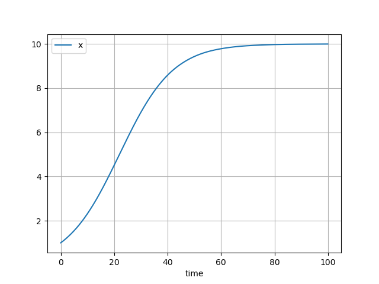

# The logistic equation

??? info "Raw code"

    The raw code for this example without explanations can be found [here](https://github.com/casasglobal-org/psymple/blob/main/examples/population_dynamics/2-logistic_population.py).

This example follows on from [Malthusian growth](malthusian_population.md). The code for a simple Malthusian population produced there is available in the drop-down box below.

??? example "Malthusian population"

    ```py
    from psymple.build import VariablePortedObject

    pop = VariablePortedObject(
        name="malthusian_pop",
        assignments=[("x", "r*x")],
        input_ports=[("r", 0.1)],
    )
    ```

The logistic equation is a simple population model which prevents populations from growing exponentially by introducing a density-dependent mortality term. The differential equation is given by 

$$ 
\frac{dx}{dt} = rx - \frac{r}{K} x^2 = rx \left( 1-\frac{x}{K} \right)
$$ 

where \( r \) is the per-capita growth rate and \( K \) is known as the *carrying capacity*. 

## A direct implementation 

The logistic equation can be simply captured by modifying the assignment of the Malthusian population `pop`, as follows.

```py
from psymple.build import VariablePortedObject

logistic_simple = VariablePortedObject(
    name="logistic_simple",
    assignments=[("x", "r*x*(1-x/K)")],
    input_ports=[("r", 0.1), ("K", 10)],
)
```

This is a perfectly valid implementation. The power of `psymple` appears, however, when the implementation reflects the structure of the model.

## A structural implementation

The right-hand side of the logistic equation is structurally the sum of two rates: the Malthusian component \( rx \), and the limiting component \( \frac{r}{K} x^2 \). The process of [variable aggregation](../../mathematics/variable_aggregation.md) ties these two components together to produce a model whose structure reflects the structure of the differential equation. 

Since the Malthusian component has already been defined using the object `pop`, it remains to define the limiting component. This can be done as follows.

```py
limit = VariablePortedObject(
    name="limit",
    assignments=[("x", "- r/K* x**2")],
    input_ports=[("r", 0.1), ("K", 10)],
)
```

The logistic model is formed in a composite ported object containing both the Malthusian and logistic limit components. A variable wire connecting their variables with a variable port `x` of the composite object tells `psymple` to aggregate the two objects together.

```py
from psymple.build import CompositePortedObject

logistic_pop = CompositePortedObject(
    name="logistic_pop",
    children=[pop, limit],
    variable_ports = ["x"],
    variable_wires=[(["malthusian_pop.x", "limit.x"], "x")],
)
```

## Sharing input parameters

To complete the logistic model, the interface of `logistic_pop` can be made the same as the simple implementation `logistic_simple` by specifying input ports for both `r` and `K`. Directed wires tell `psymple` to forward these values into the corresponding values in `malthusian_pop` and `limit`. In the case of the parameter `r`, the wire can be given multiple destinations to tell `psymple` to identify the `r` inputs of `malthusian_pop` and `limit` together.

```py
from psymple.build import CompositePortedObject

logistic_pop = CompositePortedObject(
    name="logistic_pop",
    children=[pop, limit],
    input_ports=[("r", 0.1), ("K", 10)],
    directed_wires=[
        ("r", ["malthusian_pop.r", "limit.r"]), # (1)!
        ("K", "limit.K"),
    ],
    variable_ports = ["x"],
    variable_wires=[(["malthusian_pop.x", "limit.x"], "x")],
)
```

1. Multiple destinations can be specified for a single wire by using a list.

## Running the simulation

The final thing to do is set up and run the simulation. As a bonus, it's good to check that the simulation produced by `logistic_pop` is identical to that produced to `logistic_simple`, to demonstrate the variable aggregation in action.

```py
from psymple.build import System

system_1 = System(logistic_simple)
system_1.compile()

sim_1 = system_1.create_simulation(initial_values={"x": 1})
sim_1.simulate(t_end=100)
sim_1.plot_solution()


system_2 = System(logistic_pop)
system_2.compile()

sim_2 = system_2.create_simulation(initial_values={"x": 1})
sim_2.simulate(t_end=100)
sim_2.plot_solution()
```

Running the code produces the same simulation, as expected, which is shown here. 



The simulation initially shows the population numbers increasing exponentially, before the mortality term takes over and the numbers tend towards their maximum value of \( 10 \), which is the same value as the parameter \( K \). This motivates the naming of \( K \) as the carrying capacity.