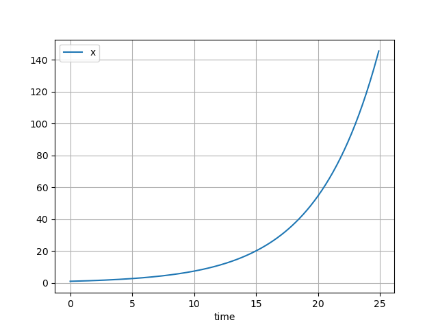

# Malthusian growth

??? info "Raw code"

    The raw code for this example without explanations can be found [here](https://github.com/casasglobal-org/psymple/blob/main/examples/population_dynamics/1-malthusian_population.py).

A fundamental equation in population dynamics describes a population which reproduces as a constant rate \(r\). Without any other influence, this population grows exponentially according to the differential equation \( \frac{dx}{dt} = rx \). This phenomenon is known as *Malthusian growth*.

This example covers:

- How to build a Malthusian growth model in `psymple`,
- How to adjust the model to have different inputs depending on the data available,
- How to build reusable model interfaces.

## Implementation in `psymple`

### Building a the differential equation

The differential equation \( \frac{dx}{dt} = rx \) is captured in a `VariablePortedObject` instance as follows.

```py
from psymple.build import VariablePortedObject

pop = VariablePortedObject(
    name="malthusian_pop",
    assignments=[("x", "r*x")],
    input_ports=[("r", 0.1)],
)
```

See [defining ODEs](../../components/variable_ported_objects.md) for more information about this syntax. Specifying The value of parameter 'r' at an input port has two advantages:

1. The variable ported object `pop` becomes a general, reusable object,
2. The default value can be overwritten from elsewhere in a larger system.

### Creating and running a simulation

The following commands create, run and plot a simulation of our equation with initial condition
\( x = 1 \). 

```py
from psymple.build import System

system_1 = System(pop)
system_1.compile()

sim_1 = system_1.create_simulation(initial_values={"x": 1})
sim_1.simulate(t_end=25)
sim_1.plot_solution()
```


### Changing parameters at simulation

The input parameter \( r \), which was given a default value of \( 0.1 \) can be overwritten at simulation. The following code creates a second simulation `sim_2` with \( r = 0.2 \). 

```py
from psymple.build import System

system_1 = System(pop)
system_1.compile()

sim_2 = system_1.create_simulation(
    initial_values={"x": 1}, 
    input_parameters={"r": 0.2}
)
sim_2.simulate(t_end=25)
sim_2.plot_solution()
```



## Overriding default behaviour with a function

Suppose that the birth rate \( b \) and death rate \( d \) of a population are known, with values \( 0.4 \) and  \( 0.2 \), respectively. This is equivalent to a Malthusian population with rate \( r = b - d \). Instead of changing the model `pop` to accept inputs `b` and `d`, the calculation for \( r \) can be performed using a `FunctionalPortedObject`, and then pass this value to the input of `pop`. 

Another benefit of this approach is to create a model which directly aligns with the data available, rather than requiring any pre-procession of birth and death rates into a single growth rate.

### Defining the rate function

The following code captures the calculation of the rate function in the object `rate`.

```py
from psymple.build import FunctionalPortedObject

rate = FunctionalPortedObject(
    name="rate",
    assignments=[("r", "b-d")],
)
```

See [defining functions](../../components/functional_ported_objects.md) for more information about this syntax. As opposed to `pop`, the inputs `b` and `d` have not been given default values, but their ports have still been created automatically. Values will be provided to these ports later in the example.

### Linking the rate function to the differential equation model

Next, the variable object 'pop' needs to read its value of 'r' from the value of 'r' produced by the function 'rate'. To do this, first import both `pop` and `rate` as children of a `CompositePortedObject`. Inside this object, defining a directed wire from 'rate.r' to 'malthusian_pop.r' tells `psymple` to identify these two values. See [defining composite models](../../components/composite_ported_objects.md) for more information about adding children and wires to composite objects.

```py
from psymple.build import CompositePortedObject

pop_system = CompositePortedObject(
    name="malthusian_pop_system",
    children=[pop, rate],
    directed_wires=[("rate.r", "malthusian_pop.r")],
)
```

Notice that the variable object 'pop' never had to be redefined. Since it was defined generally, its mechanics can be reused over and over again. The following commands simulate and plot this new system.

### Exposing inputs in a composite system

The object `pop_system` cannot be simulated until values for `b` and `d` are provided to `rate`. There are three ways this can be done: 

1. By updating the definition of `rate` to include default values for `b` and `d`,
2. By giving default values to `b` and `d` at the object `pop_system` and telling `psymple` to pass these values to `rate`,
3. By specifying values of `b` and `d` at simulation, and telling `psymple` to pass the values to `rate`. 

To accomplish either (2) or (3), input ports for `b` and `d` in the object `pop_system` need to be created, and directed wires defined from these to `rate.b` and `rate.d`, respectively. The difference between (2) and (3) is whether default values are specified for these new input ports. The following code updates the definition of `pop_system` to demonstrate method (2). 

```py
pop_system = CompositePortedObject(
    name="malthusian_pop_system",
    children=[pop, rate],
    input_ports=[("b", 0.4), ("d", 0.2)],
    directed_wires=[
        ("rate.r", "malthusian_pop.r"),
        ("b", "rate.b"),
        ("d", "rate.d")
    ],
)
```

### Simulating the composite system

The following creates a new system `system_2` for simulating `pop_system`. Notice that the initial value \( x = 1 \) must be specified by addressing `malthusian_pop.x`. The next section covers how to create an *interface* to address the initial value simply by `x`. 

With default values \( b = 0.4 \) and \( d = 0.2 \), the simulation should produce Malthusian growth with rate \( r = 0.4 - 0.2 = 0.2 \). The plot confirms this by producing the same plot obtained in the section [changing parameters at simulation](#changing-parameters-at-simulation).

```
system_2 = System(pop_system)
system_2.compile()

sim_3 = system_2.create_simulation(initial_values={"malthusian_pop.x": 1})
sim_3.simulate(t_end=25)
sim_3.plot_solution()
```


## Creating an interface

An *interface* for a ported object simply refers to the ports which it defines. In a composite ported object, input, output and variable ports can all be defined to expose internal information. 

When modelling in `psymple`, it is important to consider the interfaces of different components to maximise compatibility and reusability. For example, in population dynamics, it could make sense to decide that every model of a single population has a set of rates as inputs, and exposes a single variable. 

The model `pop` for Malthusian growth does this, exposing an input rate `r` and a variable `x`. The composite model `pop_system` for birth-death dynamics, however, only exposes its input rates `b` and `d`, and not a variable. Adding a variable to the interface of `pop_system` standardises these two models and makes them function similarly, hiding the additional complexity inside `pop_system`. Another way to view this is by giving the composite ported object `pop_system` the same type of interface as a variable ported object.

The following code adjusts the composite object `pop_system` by giving it a variable port `x`, and telling `psymple` to aggregate the values of `malthusian_pop.x` and `x` by defining a variable wire.

```py
pop_system = CompositePortedObject(
    name="malthusian_pop_system",
    children=[pop, rate],
    input_ports=[("b", 0.4), ("d", 0.2)],
    directed_wires=[
        ("rate.r", "malthusian_pop.r"),
        ("b", "rate.b"),
        ("d", "rate.d")
    ],
    variable_ports=["x"],
    variable_wires=[(["malthusian_pop.x"], "x")],
)
```