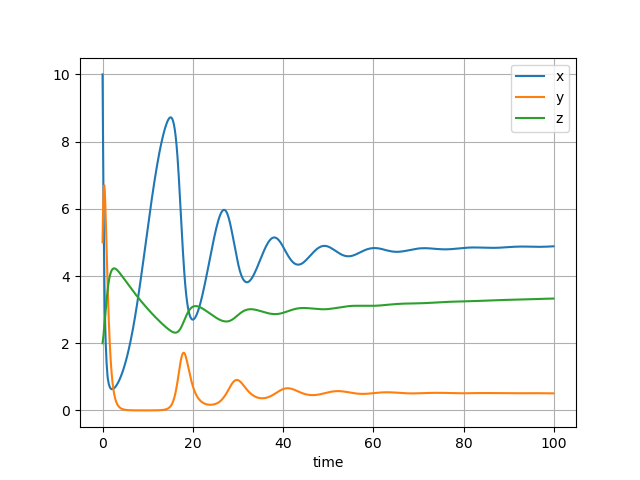

# Predator-prey systems

??? info "Raw code"

    The raw code for this example without explanations can be found [here](https://github.com/casasglobal-org/psymple/blob/main/examples/population_dynamics/3-predator_prey.py).

A predator-prey system was introduced in the [defining ODEs](../../components/variable_ported_objects.md#example) tutorial. This example shows how to build this system on top of the single-species population models constructed in [Malthusian growth](malthusian_population.md) and [logistic growth](logistic_growth.md).

## Lotka-Volterra model

This example begins with the simplest predator-prey system: the Lotka-Volterra system of differential equations for a prey species $x$ and predator $y$.

$$
\begin{align}
\frac{dx}{dt} &= a x - b xy \\
\frac{dy}{dt} &= c xy - d y
\end{align}
$$

where:

- $a>0$ is the birth rate of prey population $x$, 
- $d>0$ is the death rate of predator population $y$, 
- $b>0$ is the predation rate of $y$ on $x$, 
- $c>0$ is the response rate of $y$ from the predation on $x$.

In this example, this system will be modelled with three components: 

1. the prey equation $\frac{dx}{dt} = ax$, 
2. the predator equation $\frac{dy}{dt} = -dy$, 
3. the interaction system $\frac{dx}{dt} = -bxy, \frac{dy}{dt} = cxy$.

### Single population components

The models for the prey and predator are the simple exponential growth components constructed in the [Malthusian growth](malthusian_population.md) example.

```py
from psymple.build import VariablePortedObject

prey = VariablePortedObject(
    name="prey",
    assignments=[("x", "r*x")],
    input_ports=[("r", 0.4)],
)

pred = VariablePortedObject(
    name="pred",
    assignments=[("x", "r*x")],
    input_ports=[("r", -0.2)],
)
```

### Interaction component

The interaction component is also modelled using a `VariablePortedObject` instance.

```py
interaction = VariablePortedObject(
    name="pred-prey",
    assignments=[("x", "r_1*x*y"), ("y", "r_2*x*y")],
    input_ports=[("r_1", -0.2), ("r_2", 0.1)],
)
```

### The system model and simulation

The system is formed by the three components above, with the prey and predator variables defined by aggregating variables across the individual species model and the interaction model.

```py
from psymple.build import CompositePortedObject

ecosystem = CompositePortedObject(
    name="ecosystem",
    children=[pred, prey, interaction],
    variable_ports=["x", "y"],
    variable_wires=[
        (["prey.x", "pred-prey.x"], "x"),
        (["pred.x", "pred-prey.y"], "y"),
    ]
)
```

The following code builds and runs a simulation with initial values $x(0)=10$ and $y(0)=2$. 

```py
from psymple.build import System

system = System(ecosystem, compile=True)

sim = system.create_simulation(initial_values={"x": 10, "y": 2})
sim.simulate(t_end=100)
sim.plot_solution()
```

The simulation gives the following plot, showing the oscillations characteristic of a two-species Lotka-Volterra model.


## Logistic prey model

While the previous example exhibited stable oscillations, it is a common modelling choice to introduce a carrying capacity to populations to prevent exponential growth. The individual model of the prey species can be replaced with the one developed in the [logistic growth](logistic_growth.md) example.

```py
pop = VariablePortedObject(
    name="pop",
    assignments=[("x", "r*x")],
)

limit = VariablePortedObject(
    name="limit",
    assignments=[("x", "- r/K* x**2")],
)

prey = CompositePortedObject(
    name="prey",
    children=[pop, limit],
    input_ports=[("r", 0.4), ("K", 10)],
    directed_wires=[
        ("r", ["pop.r", "limit.r"]), 
        ("K", "limit.K"),
    ],
    variable_ports = ["x"],
    variable_wires=[(["pop.x", "limit.x"], "x")],
)
```

Since this model has the same interface as the previous Malthusian growth model for `prey`, the composite model `ecosystem` and the simulation can be run exactly as before. Here is the simulation output.


The simulation still exhibits oscillations, but this time decaying in magnitude as the system approaches the steady state of $x=2$, $y=\frac{8}{5}$. See the drop-down box below for this calculation.

??? example "Steady state calculation"

    The system constructed above is of the form 

    $$
    \begin{align}
    \frac{dx}{dt} &= ax \left( 1-\frac{x}{K} \right) - bxy \\
    \frac{dy}{dt} &= cxy - dy
    \end{align}
    $$

    A *steady state* of the system occurs when both derivatives are zero. There are three cases:

    - if $x=0$, then either equation implies $y=0$,
    - if $y=0$, then the first equation gives $ax \left( 1-\frac{x}{K} \right) = 0$, or equivalently $x = K$ (the solution $x=0$ is the above case),
    - if both $x \ne 0$ and $y \ne 0$, the second equation gives $x=\frac{d}{c}$ and the first equation gives 
    
        $$
        y = \frac{a}{b} \left( 1-\frac{x}{K} \right) = \frac{a}{b} \left( 1-\frac{a}{bK} \right).
        $$

        Substituting $a=0.4, b=0.2, c=0.1, d=0.2$ and $K=10$ gives the steady state $x=2$ and $y=2 \times \frac{4}{5} = \frac{8}{5}$.

## Tritrophic systems

Almost all ecosystems in nature are *tritrophic*, meaning there are at least three different types of consumer in the food chain. For example, the chain can consist of a plant which produces energy from sunlight and soil nutrients, a herbivore which eats the vegetative matter of the plant for its growth, and a carnivore which predates on the herbivore. The interactions between these trophic levels create the fine balance in an ecosystem, but are difficult to study and model. 

In `psymple`, a tritrophic model can be built out of components in the same way as the predator-prey models already considered, which are *bitrophic* in nature. This example constructs the following system of equations:

$$
\begin{align}
\frac{dx}{dt} &= ax \left( 1-\frac{x}{K} \right) - bxy \\
\frac{dy}{dt} &= cxy - dy - eyz \\
\frac{dz}{dt} &= fyz - gz
\end{align}
$$

### Individual species models

The prey $x$ is given the logistic species model `prey` constructed [above](#logistic-prey-model). The middle predator $y$ and the apex predator $z$ are both given exponential decay models:

```py
pred_mid = VariablePortedObject(
    name="pred_mid",
    assignments=[("x", "r*x")],
    input_ports=[("r", -0.8)],
)

pred_apex = VariablePortedObject(
    name="pred_apex",
    assignments=[("x", "r*x")],
    input_ports=[("r", -0.05)],
)
```

### Interactions

There are two interactions in the system, one between the prey and the intermediate predator, and the second between the intermediate and apex predators. These are defined as follows:

```py
int_prey_mid = VariablePortedObject(
    name="int_prey_mid",
    assignments=[("x", "r_1*x*y"), ("y", "r_2*x*y")],
    input_ports=[("r_1", -0.4), ("r_2", 0.3)],
)

int_mid_apex = VariablePortedObject(
    name="int_mid_apex",
    assignments=[("x", "r_1*x*y"), ("y", "r_2*x*y")],
    input_ports=[("r_1", -0.2), ("r_2", 0.1)],
)
```

### Ecosystem and simulation

The ecosystem is then constructed using a series of variable aggregations.

```py

ecosystem = CompositePortedObject(
    name="ecosystem",
    children=[prey, pred_mid, pred_apex, int_prey_mid, int_mid_apex],
    variable_ports=["x", "y", "z"],
    variable_wires=[
        (["prey.x", "int_prey_mid.x"], "x"),
        (["pred_mid.x", "int_prey_mid.y", "int_mid_apex.x"], "y"),
        (["pred_apex.x", "int_mid_apex.y"], "z")
    ]
)
```

The simulation is defined and run in the usual way.

```py
system = System(ecosystem, compile=True)

sim = system.create_simulation(initial_values={"x": 10, "y": 5, "z": 2})
sim.simulate(t_end=100)
sim.plot_solution()
```



The simulation shows the system oscillating before approaching stable equilibria. For this set of parameters, the middle predator doesn't thrive as well as the apex predator.


