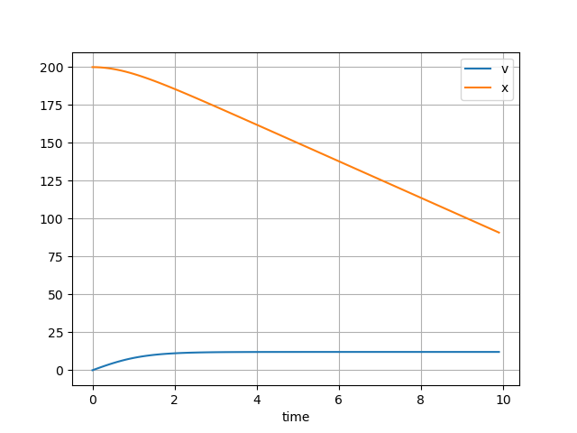
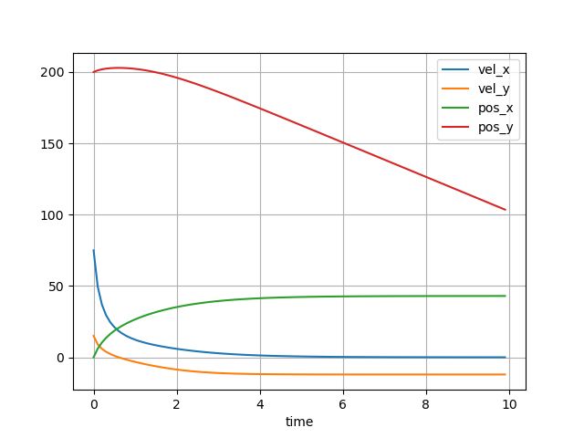
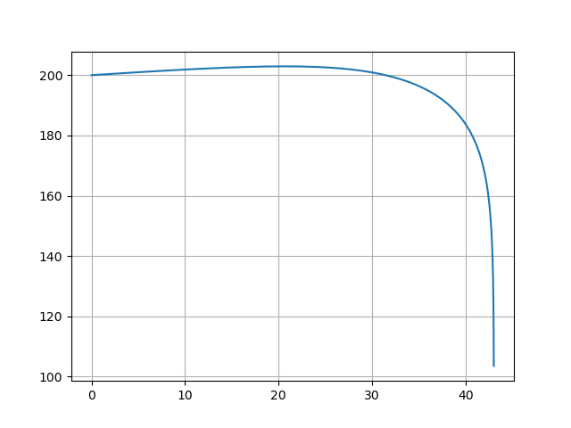

# Projectile motion

??? info "Raw code"

    The raw code for this example without explanations can be found [here](https://github.com/casasglobal-org/psymple/blob/main/examples/second_order_ODEs/1-projectile_motion.py).

The motion of a projectile can be affected by multiple forces. This example considers the motion of an object under gravity, which adds an acceleration vertically downwards, and air resistance which acts against the velocity vector.

In general, the force exerted due to air resistance is given by

$$
\mathbf{F}_D = \frac{1}{2}C_D \rho A v \mathbf{v}
$$

where $C_D$ is the drag coefficient, $\rho$ is the air density, $A$ is the surface area, $\mathbf{v}$ is the velocity vector and $v$ is its magnitude.

## Vertical motion

The special case where the motion is vertically downwards is built up in the user guide, through [composite systems](../../components/composite_ported_objects.md), [defining systems](../../user_guide/system.md) and [running simulations](../../user_guide/simulation.md). For completeness, the final version of that example is repeated here, with an added variable tracking the position of the projectile.

### System functions and parameters

In `psymple` functions and parameters can be specified at the system level to speed up implementation. In this case the system defines the acceleration due to gravity, $g=\pu{9.81 m/s^2}$, ambient air density $\rho = \pu{1.225 kg/m^3}$, and the function $frac_0$, defined by $frac_0(a,b,d) = \frac{a}{b}$ if $b \ne 0$ and $frac_0(a,b,d) = d$ if $b=0$.

```py
frac_0 = lambda a,b,d: a/b if b != 0 else d

from psymple.build import System

system = System()
system.add_system_parameter("g", "9.81"),
system.add_system_parameter("rho", "1.225")
system.add_utility_function(name="frac_0", function=frac_0)
```

### Differential equation system

When the projectile has mass, the equations of motion are given by

$$
\begin{align}
\frac{dv}{dt} &= g - \frac{1}{2m}C_D \rho A v^2 \\
\frac{dx}{dt} &= -v
\end{align}
$$

A `psymple` model for this system is given as follows.

```py
from psymple.build import (
    FunctionalPortedObject, 
    VariablePortedObject,
    CompositePortedObject,
)

v_gravity = VariablePortedObject( 
    name="v_gravity",
    assignments=[("v", "g"), ("x", "-v")], 
)

v_drag = VariablePortedObject(
    name="v_drag",
    assignments=[("v", "-mu * v**2")],
)

f_drag = FunctionalPortedObject(
    name="f_drag",
    assignments=[("mu", "frac_0(1/2 * C * rho * A, m, 0)")], 
)

model = CompositePortedObject(
    name="model",
    children=[v_gravity, v_drag, f_drag],
    input_ports=["C", "A", "m"],
    variable_ports=["v", "x"],
    directed_wires=[
        ("C", "f_drag.C"),
        ("A", "f_drag.A"),
        ("m", "f_drag.m"),
        ("f_drag.mu", "v_drag.mu"), 
    ],
    variable_wires=[
        (["v_gravity.v", "v_drag.v"], "v"),
        (["v_gravity.x"], "x"),
    ],
)   
```

!!! info "Only aggregate once"

    Note that the aggregation in the above example only happens across the velocity `v` and not the position `x`. In general, consider first-order systems 

    $$
    \begin{align}
    \dot{y}_i &= f_i \\ \dot{x}_i &= y_i
    \end{align}
    $$

    implementing the second-order ODE $\ddot{x}_i = f_i$ for $i=1,2$. If $x_1$ and $x_2$ are aggregated to a variable $x$ with differential equation $\dot{x} = y_1 + y_2$, then the equation $\ddot{x} = f_1 + f_2$ would be correct. If additionally, however, $y_1$ and $y_2$ are also aggregated to a variable $y$, then

    $$
    \ddot{x} = \dot{y}_1 + \dot{y}_2 = (f_1 + f_2) + (f_1 + f_2) = 2(f_1+f_2)
    $$

    that is, the equation is doubled. Therefore one must be careful to only aggregate over either the variables $x_i$ or the variables $y_i$, but not both.

### Simulation

To build a simulation, the composite object `model` needs to be added to the existing `system` instance. A simulation is then created and run in the usual way.

```py
system.set_object(model)

sim = system.create_simulation(
    initial_values = {"v": 0, "x": 200}, 
    input_parameters={"C": 1.1, "A": 0.2, "m": 2})
sim.simulate(t_end=10)

sim.plot_solution()
```



The simulation shows that the object accelerates from rest to a terminal velocity of ~$\pu{12.067 m/s}$. This agrees with value given by the standard formula for terminal velocity

$$
v_t = \sqrt{\frac{2mg}{\rho A C_D}}
$$

obtained by finding the steady state of the equations of motion, after substituting the simulation values of $m=2$, $\rho=1.225$, $A=0.2$ and $C_D = 1.1$. 

## Projectile motion in a plane

A more general case allows the projectile to move freely in the $x-y$ plane.

### Model setup

The model for motion in a plane in almost identical to the vertical special case. One difference is now four variables are required to track the coordinate motion: two for distance and two for velocity. The second difference is that the drag magnitude function must be given the projectile's speed: $s = \sqrt{v_x^2 + v_y^2}$. This is calculated using a `FunctionalPortedObject` instance:

```py
speed = FunctionalPortedObject(
    name="speed",
    assignments=[("s", "sqrt(v_x**2 + v_y**2)")]
)
```

Finally, the positive direction is now set as upwards. The full model is given in the drop-down box below.

??? example "Planar projectile motion"

    ```py
    motion = VariablePortedObject(
        name="motion",
        assignments=[
            ("v_x", "0"),
            ("v_y", "-g"),
            ("pos_x", "v_x"),
            ("pos_y", "v_y"),
        ]
    )

    drag = VariablePortedObject(
        name="drag",
        assignments=[
            ("v_x", "-mu*v_x*s"),
            ("v_y", "-mu*v_y*s"),
        ]
    )

    drag_magnitude = FunctionalPortedObject(
        name="drag_magnitude",
        assignments=[("mu", "frac_0(1/2*coeff*rho*area,mass,0)")]
    )

    speed = FunctionalPortedObject(
        name="speed",
        assignments=[("s", "sqrt(v_x**2 + v_y**2)")]
    )

    model = CompositePortedObject(
        name="proj",
        children=[motion, drag, drag_magnitude, speed],
        input_ports=["C", "A", "m"],
        variable_ports=["pos_x", "pos_y", "vel_x", "vel_y"],
        directed_wires=[
            ("C", "drag_magnitude.coeff"),
            ("A", "drag_magnitude.area"),
            ("m", "drag_magnitude.mass"),
            ("drag_magnitude.mu", "drag.mu"),
            ("motion.v_x", "speed.v_x"),
            ("motion.v_y", "speed.v_y"),
            ("speed.s", "drag.s"),
        ],
        variable_wires=[
            (["motion.v_x", "drag.v_x"], "vel_x"),
            (["motion.v_y", "drag.v_y"], "vel_y"),
            (["motion.pos_x"], "pos_x"),
            (["motion.pos_y"], "pos_y"),
        ]
    )
    ```

### Simulating and plotting

The following simulation fires the same projectile as for the vertical case from the same position, except now with a horizontal velocity of $\pu{75 m/s}$ and vertical velocity of $\pu{15 m/s}$ (upwards). 

```py 
system.set_object(model)

sim = system.create_simulation(
    initial_values ={"pos_x": 0, "pos_y": 200, "vel_x": 75, "vel_y": 15}, 
    input_parameters={"C": 1.1, "A": 0.2, "m": 2})
sim.simulate(t_end=10)
sim.plot_solution()
```



## Producing other plots

The plotting functionality in `psymple` is currently fairly basic. It is, however, straight-forward to extract simulation time series to produce more custom plots. The following code produces a positional plot of the projectile.

```py
import matplotlib.pyplot as plt

pos_x = sim.variables["pos_x"].time_series
pos_y = sim.variables["pos_y"].time_series

plt.plot(pos_x, pos_y)
plt.grid()
plt.show()
```




