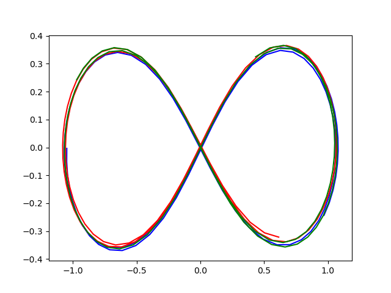

# Three body problem

??? info "Raw code"

    The raw code for this example without explanations can be found [here](https://github.com/casasglobal-org/psymple/blob/main/examples/second_order_ODEs/2-three_body_problem.py).

The three body problem, or more generally the $n$-body problem, is a classical problem in celestial mechanics. The statement of the problem is to find the trajectories of three or more massive bodies under the gravitational influence of each other. 

## System of equations

The magnitude of the gravitational force acting between two objects of masses $m_1$ and $m_2$ is given by $F = \frac{Gm_1m_2}{r^2}$, where $G = \pu{6.67 \times 10^{-11} N m^2/kg}$ and $r$ is the distance between their centres. 

For the dynamics of two or more bodies, each body experiences a gravitational force from every other body in the direction of that body with the above magnitude. Therefore for $n$ bodies, the system of differential equations is derived by applying Newton's second law:

$$
\frac{d^2 \mathbf{r}_i}{dt^2} = \sum_{1 \leqslant i \ne j \leqslant n} G m_j \frac{(\mathbf{r}_j - \mathbf{r}_i)}{|\mathbf{r}_j - \mathbf{r}_i|^3}, \qquad i=1,\dots,n.
$$

## Setup in `psymple`

To model the $n$-body problem in `psymple`, for simplicity assume the motion is happening in a plane, so that $\mathbf{r}_i = (x_i, y_i)$. Then each differential equation above corresponds to a pair of second-order differential equations in $x_i$ and $y_i$. To implement this in `psymple` requires an additional pair of equations for $v_{x_i}$ and $v_{y_i}$, the components of the velocity $\frac{d \mathbf{r}_i}{dt}$. 

The following implementation models the force components

$$
F_{ij} = \frac{Gm_j}{((x_j-x_i)^2 + (y_j - y_i)^2)^{\frac{3}{2}}} \left(x_j - x_i, y_j-y_i \right)
$$

for $i \ne j$. The velocity components of body $i$ satisfy the differential equations obtained by aggregating the components of $F_{ij}$ for $j=1,\dots,i-1,i+1,\dots,n$. 

### Common objects

The following objects are common calculations for each $F_{ij}$. 

```py
from psymple.build import VariablePortedObject, FunctionalPortedObject

vars = VariablePortedObject(
    name="vars",
    assignments=[
        ("v_x", "mu * Del_x"),
        ("v_y", "mu * Del_y"),
    ]
)

dist = FunctionalPortedObject(
    name="dist",
    assignments=[
        ("Del_x", "x_o - x"),
        ("Del_y", "y_o - y"),
        ("d", "sqrt((x_o-x)**2 + (y_o-y)**2)"),
    ]
)

force = FunctionalPortedObject(
    name=f"force",
    assignments=[("mu", "G*m/d**3")]
)
```

### Velocity model

The following class `velocity` is used to create the model for $F_{ij}$, with the argument `id` used to identify each pair $(i,j)$. 

```py
from psymple.build import CompositePortedObject 

class velocity(CompositePortedObject):

    def __init__(self, id):
        super().__init__(
            name=f"velocity_{id}",
            children=[vars, force, dist],
            input_ports=["x", "y", "x_o", "y_o", "m_o"],
            variable_ports=["v_x", "v_y"],
            output_ports=["v_x", "v_y"],
            directed_wires=[
                ("m_o", "force.m"),
                ("x", "dist.x"),
                ("y", "dist.y"),
                ("x_o", "dist.x_o"),
                ("y_o", "dist.y_o"),
                ("dist.Del_x", "vars.Del_x"),
                ("dist.Del_y", "vars.Del_y"),
                ("dist.d", "force.d"),
                ("force.mu", "vars.mu"),
                ("vars.v_x", "v.x"),
                ("vars.v_y", "v.y"),
            ],
            variable_wires=[
                (["vars.v_x"], "v_x"),
                (["vars.v_y"], "v_y")
            ]
        )
```

!!! tip "Wrapping `psymple` objects in classes"

    Using classes to wrap objects in `psymple` is a powerful way to maximise reusability of objects, create custom behaviour depending on arguments, or implement custom functions and attributes to simplify model building.

Similarly, the following class `pos` will be used to integrate the velocity variables to calculate the position of each body.

```py
class pos(VariablePortedObject):
    def __init__(self, id):
        super().__init__(
            name=f"pos_{id}",
            assignments=[
                ("x", "v_x"),
                ("y", "v_y"),
            ]
        )
```

### Defining the system with aggregation

First, specify some helpful identifiers for the orbiting bodies and the interactions between them.

```py
n=3

bodies = [f"{i+1}" for i in range(n)]
ints = [f"{i+1},{j+1}" for i in range(n) for j in range(n) if i != j]
```

Next, create instances of all the interactions and position integrators that will make up the system components.

```py
forces = [velocity(id) for id in ints]
positions = [pos(id) for id in bodies]
```

Finally, define the composite system. This object exposes as inputs the masses of each body, connects these masses to the relevant force components, and connects the velocity variables to the position integrators. Finally, it aggregates the velocity components together and exposes all velocity and position variables.

```py
coords = ["x", "y"]

n_body_model = CompositePortedObject(
    name="system",
    children = forces + positions,
    variable_ports=[
        port 
        for i in bodies 
        for port in [f"x_{i}", f"y_{i}", f"v_x_{i}", f"v_y_{i}"]
    ],
    input_ports=[f"m_{i}" for i in bodies],
    directed_wires=[
        (f"m_{i}", [f"velocity_{j},{i}.m_o" for j in bodies if j != i])
        for i in bodies
    ]
    + [
        (
            f"pos_{i}.{coord}", 
            [f"velocity_{i},{j}.{coord}" for j in bodies if j != i]
            + [f"velocity_{j},{i}.{coord}_o" for j in bodies if j != i]
        )
        for i in bodies for coord in coords
    ]
    + [
        (f"velocity_{i},{int(i)%n + 1}.v_{coord}", f"pos_{i}.v_{coord}") # (1)!
        for i in bodies for coord in coords
    ],
    variable_wires=[
        (
            [f"velocity_{i},{j}.v_{coord}" for j in bodies if j != i], 
            f"v_{coord}_{i}"
        )
        for i in bodies for coord in coords
    ]
    + [
        ([f"pos_{i}.{coord}"], f"{coord}_{i}")
        for i in bodies for coord in coords
    ],
)
```

1. The choice `int(i)%n + 1` ensures only one of the interaction components connects to a position integrator for each $i$. 


## Simulation and plots

To run a simulation, a `System` instance is created for `n_body_model` which also specifies the system parameter `G`, the gravitational constant. In this example, matters are scaled so that $G = 1$. 

```py
S = System(
    n_body_model,
    system_parameters=[("G", 1)],
    compile=True
)
```

### A choice of initial conditions

There are many initial conditions and values of masses for each body which create interesting behaviour for a three body problem. Here is just one set.

```py
initial_values={
    "x_1": 0.9700436,
    "y_1": -0.24308753,
    "x_2": 0,
    "y_2": 0,
    "x_3": -0.9700436,
    "y_3": 0.24308753,
    "v_x_1": 0.466203685,
    "v_y_1": 0.43236573,
    "v_x_2": -2*0.466203685,
    "v_y_2": -2*0.43236573,
    "v_x_3": 0.466203685,
    "v_y_3": 0.43236573,
}

input_parameters={
    "m_1": 1,
    "m_2": 1,
    "m_3": 1,
}
```

Here is the simulation run.

```py
sim = S.create_simulation(
    initial_values=initial_values,
    input_parameters=input_parameters,
)

sim.simulate(t_end=10)
```

### Trajectory plots

Rather than use the command `sim.plot_solution()` to generate the time series plots, the six position variables can instead be extracted and plotted against each other to generate the trajectory plots for each of the three bodies.

```py
import matplotlib.pyplot as plt

x_1 = sim.variables["x_1"].time_series
y_1 = sim.variables["y_1"].time_series

x_2 = sim.variables["x_2"].time_series
y_2 = sim.variables["y_2"].time_series

x_3 = sim.variables["x_3"].time_series
y_3 = sim.variables["y_3"].time_series


plt.plot(x_1, y_1, color="blue")
plt.plot(x_2, y_2, color="red")
plt.plot(x_3, y_3, color="green")

plt.show()
```




